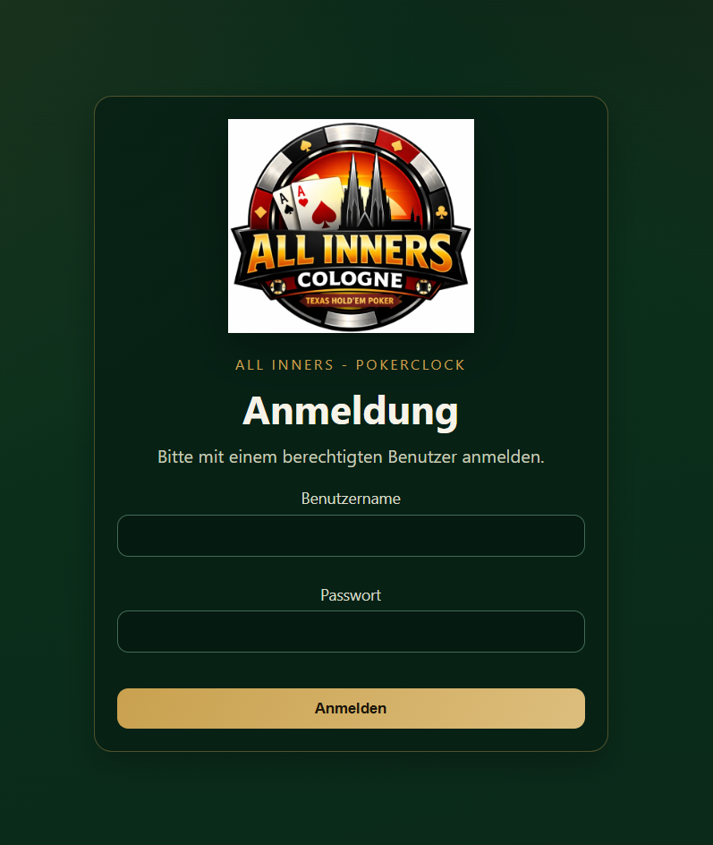
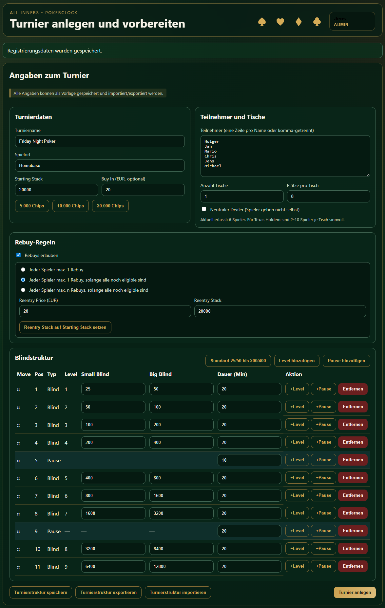
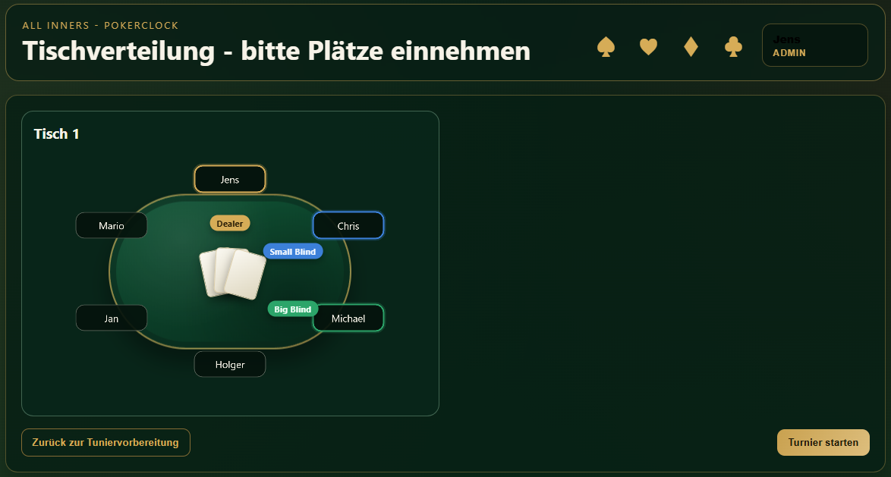
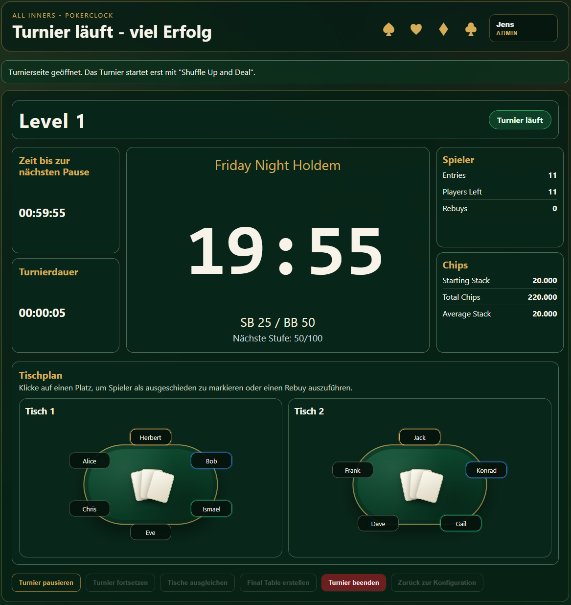
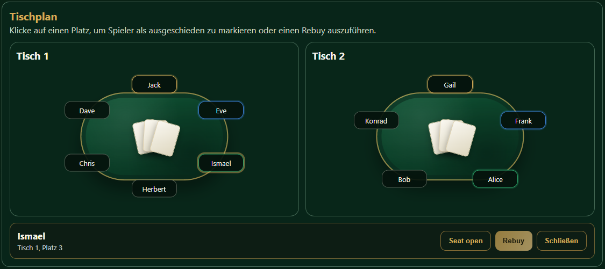
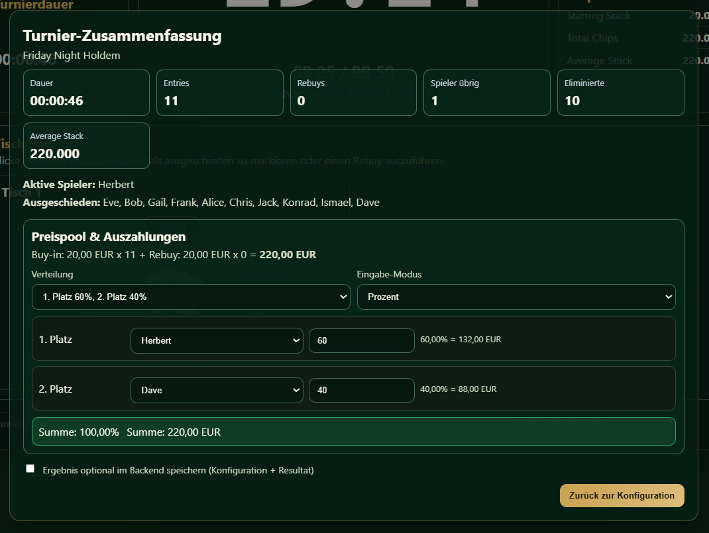

# PokerClock – Pokerturniere digital organisieren

Eine auf **Spring Boot** + **React** basierende Webanwendung zur digitalen Vorbereitung, Durchführung und Verwaltung von Pokerturnieren mit Live-Tischverteilung, Blindstruktur-Verwaltung, kontrolliertem Turnierstart per **Shuffle Up and Deal**, manuellem Tischmanagement und abschließender Ergebnisregistrierung.

---

## 📋 Inhaltsverzeichnis

1. [Architektur](#-architektur)
2. [Technologie-Stack](#-technologie-stack)
3. [Projekt-Struktur](#-projekt-struktur)
4. [Build & Entwicklung](#-build--entwicklung)
5. [Docker: Build, Deploy & Start](#-docker-build-deploy--start)
6. [Screenshots der Anwendung](#-screenshots-der-anwendung)
7. [Funktionen & Features](#-funktionen--features)
8. [Exemplarischer Turnierablauf](#-exemplarischer-turnierablauf)
9. [Beiträge & Änderungswünsche](#beiträge--änderungswünsche)
10. [Lizenz](#lizenz)
11. [Haftungsausschluss](#haftungsausschluss)

---

## 🏗️ Architektur

PokerClock folgt einer klassischen **Client-Server-Architektur**:

### Backend (Spring Boot 4)
- **REST-API** für Turnierverwaltung, Authentifizierung und Echtzeit-Status
- **PostgreSQL-Datenbank** für persistente Speicherung (Registrierungsvorlagen, Turniere, Ergebnisse)
- **JPA/Hibernate** für Datenzugriff und Entitätsverwaltung
- **Service-Layer** als zentrale fachliche Logik für Turnierzustände, Zeitberechnung, Tischverteilung, Rebuy-Verarbeitung und Ergebnisaufbereitung
- Endpoints:
  - `/api/auth/` – Login, Logout, Authentifizierung
  - `/api/registration/templates/` – Registrierungsvorlagen (CRUD, Import/Export)
   - `/api/` – Turnier-Setup, Status, Aktionen (Start, Pause, Resume, End, Seat Open, Rebuy)
   - `/api/table/` – Tischmanagement (Balancing, Final Table)
  - `/api/results` – Optionale Speicherung von Turnierergebnissen

### Fachliche Zustandslogik
- Ein Turnier durchläuft die Zustände **READY**, **RUNNING**, **PAUSED** und **ENDED**.
- Der Wechsel von der Tischverteilung auf die Turnierseite ist bewusst vom echten Start getrennt.
- Erst über **Shuffle Up and Deal** beginnt das Turnier fachlich: Die Startsequenz wird abgespielt und die Uhr wird gestartet.
- Organisatorische Eingriffe wie **Tische ausgleichen** und **Final Table erstellen** sind ausschließlich im Zustand **PAUSED** erlaubt.

### Architektonische Besonderheiten der Turniersteuerung
- Die **Tischverteilung** wird serverseitig als JSON im Turnier gespeichert und bei Statusabfragen an das Frontend zurückgegeben.
- Das Frontend arbeitet zustandsorientiert mit den Ansichten **Registrierung**, **Tischverteilung**, **Turnier** und **Zusammenfassung**.
- Die Turnierseite verwendet denselben Status-Endpunkt sowohl für Clock, Blindinformationen und Kennzahlen als auch für die Anzeige des aktuellen Tischplans.
- Die Ergebniszusammenfassung ist als kontrollierter Abschlussdialog umgesetzt: Sie wird nach Turnierende angezeigt und kann nur über die vorgesehenen Aktionen verlassen werden.

### Frontend (React 18 + Vite)
- **React-Komponenten** für alle Phasen (Authentifizierung, Registrierung, Tischverteilung, Turnier, Ergebnisse)
- **Vite** als Build-Tool und Dev-Server
- **CSS Modules** für Styling
- ✓ Responsive Design für Desktop und Tablet

### Persistenz & Datenbank
- **PostgreSQL** läuft im Docker Container
- Automatische Schemamigrationen via Flyway/Hibernate
- Volumes für Datenpersistenz über Container-Restarts

### Authentifizierung
- **Session-basiert** mit Token-Header (`X-Auth-Token`)
- Benutzer in PostgreSQL verwaltet

---

## 🛠️ Technologie-Stack

| Komponente | Technologie | Version |
|------------|-------------|---------|
| Backend | Spring Boot | 4.0.5 |
| Language (Backend) | Java | 25 |
| Language (Frontend) | JavaScript (React) | ES2020+ |
| Database | PostgreSQL | - |
| Build (Frontend) | Vite | 5.4 |
| Container | Docker & Docker Compose | - |
| ORM | JPA/Hibernate | - |

---

## 📁 Projekt-Struktur

```
PokerClock/
├── backend/
│   ├── src/main/java/com/pokerclock/
│   │   ├── api/                    # REST DTOs (Request/Response)
│   │   ├── controller/             # REST Endpoints
│   │   ├── model/                  # JPA Entities
│   │   ├── repository/             # Data Access Layer (JPA)
│   │   ├── service/                # Business Logic
│   │   └── config/                 # Spring Config (Security, Web, DB)
│   ├── pom.xml                     # Maven Dependencies
│   └── Dockerfile                  # Container für Backend
│
├── frontend/
│   ├── src/
│   │   ├── pages/                  # Page Components (Login, Turnier, etc.)
│   │   ├── components/             # Reusable Components
│   │   ├── api.js                  # API-Client
│   │   ├── App.jsx                 # Root Component
│   │   └── index.css               # Global Styles
│   ├── package.json                # NPM Dependencies
│   ├── vite.config.js              # Vite Config
│   └── Dockerfile                  # Container für Frontend
│
├── docker-compose.yml              # Orchestration (Backend, Frontend, DB)
└── README.md                       # Diese Datei
```

---

## 🔨 Build & Entwicklung

### Voraussetzungen
- **Node.js** 18+ (für Frontend)
- **Java 25** (für Backend)
- **Maven 3.8+** (für Backend)
- Optional: **Docker Desktop** (für containerisierte Entwicklung)

### Entwicklung (lokal)

#### 1. Backend starten
```bash
cd backend
mvn spring-boot:run
```
✓ Backend verfügbar unter `http://localhost:8080`

#### 2. Frontend starten (in neuem Terminal)
```bash
cd frontend
npm install
npm run dev
```
✓ Frontend verfügbar unter `http://localhost:5173` (oder wie in der Konsole angezeigt)

### Build für Production

#### Frontend bauen
```bash
cd frontend
npm install
npm run build
# Output: dist/
```

#### Backend bauen
```bash
cd backend
mvn clean package -DskipTests
# Output: target/pokerclock-backend-0.0.1-SNAPSHOT.jar
```

---

## 🐳 Docker: Build, Deploy & Start

### Mit Docker Desktop UI (einfachste Methode)

1. **Docker Desktop starten** (falls nicht bereits laufend)

2. **Umgebungsvariablen vorbereiten (Pflicht):**
   ```bash
   # macOS / Linux
   cp .env.example .env
   ```
   ```powershell
   # Windows PowerShell
   Copy-Item .env.example .env
   ```
   Dann in `.env` sichere Werte setzen:
   - `POSTGRES_PASSWORD`
   - `DB_PASSWORD`

   Optional für lokale Entwicklung (Seed-Admin):
   - `APP_SEED_ADMIN_USERNAME`
   - `APP_SEED_ADMIN_PASSWORD`
   - `APP_SEED_ADMIN_ROLE` (Default: `ADMIN`)

3. **Im Projektstamm das Docker Compose File starten:**
   ```bash
   # Terminal im Root-Verzeichnis (wo docker-compose.yml liegt)
   docker compose up --build
   ```

4. **In der Docker Desktop UI beobachten:**
   - Öffne Docker Desktop App
   - Gehe zu **Containers**
   - Du siehst Logs und Status der Container (pokerclock-backend, pokerclock-frontend, db)

5. **Application testen:**
   - Frontend: `http://localhost:3000`
   - Backend Status: `http://localhost:8080/actuator/health`

6. **Stack stoppen:**
   ```bash
   docker compose down
   ```

### Stack-Details (docker-compose.yml)

| Service | Port | Beschreibung |
|---------|------|-------------|
| `frontend` | 3000 | React App (Nginx) |
| `backend` | 8080 | Spring Boot REST API |
| `db` | 5432 | PostgreSQL (nicht von außen sichtbar) |

### Volumes & Persistenz
- `db_data` – PostgreSQL Daten (persistent über Restarts)
- Automatische Datenbank-Initialisierung beim ersten Start

### Logs in Docker Desktop
- Klick auf einen Service → **Logs** Tab → Echtzeit-Ausgabe

---

## 🔐 Sicherheits- & Deployment-Checkliste (Pflicht vor Veröffentlichung)

Diese Punkte sollten erledigt sein, bevor du die App anderen zeigst oder in ein erreichbares Umfeld deployest.

### A) Für **lokales Docker Desktop** (lokal)

1. **Lokale Secrets setzen, nie committen**
   - `.env.example` nach `.env` kopieren.
   - Starke Werte für `POSTGRES_PASSWORD` und `DB_PASSWORD` setzen.
   - Sicherstellen, dass `.env` nicht versioniert ist.

2. **Seed-Admin nur bei Bedarf aktivieren**
   - Optional `APP_SEED_ADMIN_USERNAME` und `APP_SEED_ADMIN_PASSWORD` setzen.
   - Für normale Nutzung leer lassen, damit kein Auto-Seed erfolgt.

3. **Image/Code-Stand bereinigen**
   - Keine Build-Artefakte in Git (`target/`, `dist/`).
   - Keine temporären lokalen Dateien mit Zugangsdaten im Repo.

4. **Sichtprüfung vor Freigabe**
   - `git status` muss sauber sein.
   - Nochmal nach harten Credentials suchen (z. B. mit `gitleaks`).

### B) Für **offenes Kubernetes-Cluster** (Internet / extern erreichbar)

1. **Secrets-Management erzwingen**
   - Keine Klartext-Secrets in `Deployment`, `ConfigMap`, `values.yaml`.
   - Secrets nur über `Secret`, Sealed Secrets, External Secrets oder Vault.
   - Keine Default-Passwörter verwenden.

2. **Produktionsfähige Authentifizierung verwenden**
   - Aktuell ist die Session-Verwaltung in-memory und auf einfache Nutzung ausgelegt.
   - Für offene Umgebungen stattdessen robuste Auth-Lösung einsetzen (z. B. OIDC/JWT + serverseitige Session-/Token-Strategie).
   - Token-Lebensdauer, Logout-Invalidierung und Rotationsstrategie definieren.

3. **Transport & Ingress absichern**
   - Nur HTTPS/TLS, HTTP auf HTTPS umleiten.
   - CORS restriktiv setzen (nur benötigte Origins).
   - Security-Header auf Ingress/Proxy aktivieren.

4. **Datenbank absichern**
   - DB nicht öffentlich exponieren.
   - Eigener DB-User mit minimalen Rechten.
   - Backups, Restore-Test und Rotationsprozess für DB-Credentials definieren.

5. **Container-Härtung**
   - Images mit festen Versionen bauen, regelmäßig patchen.
   - Container möglichst als non-root ausführen.
   - `readOnlyRootFilesystem`, `allowPrivilegeEscalation: false`, sinnvolle `securityContext` setzen.

6. **Netzwerk- und Laufzeitschutz**
   - `NetworkPolicy` für minimale Verbindungen.
   - Ressourcenlimits und Requests setzen.
   - Liveness/Readiness-Probes aktiv halten.

7. **Betrieb & Monitoring**
   - Zentrales Logging und Metriken aktivieren.
   - Alerting für Fehlerquoten, Restart-Loops, Auth-Fehler, DB-Verbindungsprobleme.
   - Auditierbare Deployment-Pipeline verwenden.

8. **Compliance vor Public Release**
   - Git-Historie auf alte Secrets prüfen und ggf. bereinigen.
   - Alle früher verwendeten Credentials rotieren.
   - Optional: Secret-Scanning als CI-Gate erzwingen.

### Empfohlener Minimalablauf vor Veröffentlichung

1. Lokalen Stand committen und `git status` prüfen.
2. Secret-Scan über aktuellen Stand und Historie durchführen.
3. Betroffene Credentials rotieren.
4. Erst danach Repository/Deployment öffentlich machen.

---

## 📸 Screenshots der Anwendung

### 1. Login Screen


**Beschreibung:**
- Authentifizierung mit Benutzername und Passwort
- Session-Token wird nach Login gespeichert
- Fehlerbehandlung bei falschen Credentials

### 2. Turniervorbereitung (Registrierung & Blindstruktur)


**Beschreibung:**
- **Turnierdaten:** Name, Standort, Starting Stack
- **Finanzielle Parameter:** Buy-in in EUR, Rebuy-Optionen mit Preisen
- **Teilnehmer:** Liste der Spieler (kommagetrennt oder zeilenweise)
- **Blindstruktur-Editor:**
  - Levels mit Small Blind / Big Blind
  - Pause-Einträge
  - Drag & Drop zum Reordern
  - Standardstruktur verfügbar
- **Speichern & Importieren:** JSON-Export und -Import von Vorlagen

### 3. Tischverteilung (Preparation Phase)


**Beschreibung:**
- Visuelle Darstellung der Tischverteilung
- Alle Spieler sind zugeordnet
- Dealer- und Blinds-Positionen sind markiert
- Kontrollierter Übergang mit **„Turnier kann beginnen“**
- Bestätigungsdialog vor dem Wechsel auf die Turnierseite
- Noch **kein** Sound und **kein** Start der Uhr in dieser Phase
- Möglichkeit, zur Konfiguration zurückzukehren

### 4. Turnier im Betrieb (Running Tournament)


**Beschreibung:**
- **Ready-Phase vor dem echten Start:** Nach dem Wechsel auf die Turnierseite ist zunächst nur der Turnierstatus sichtbar.
- **Shuffle Up and Deal** ist der fachliche Startpunkt: Erst dann laufen Beep-Sequenz, Sprachansage und Clock.
- **Live Clock:** Countdown für aktuelle Blindstufe
- **Current Blinds:** SB/BB-Werte und nächste Stufe
- **Spieler-Statistiken:** Entries, Players Left, Average Stack, Total Chips
- **Rebuys:** Gezählte Rebuys während des Turniers
- **Tischplan:** Alle aktiven Spieler mit Live-Anzeige
- **Kontrollbuttons:** abhängig vom Zustand, z. B. Shuffle Up and Deal, Pause, Resume, End Tournament

### 5. Spieler-Aktionen (Seat Open / Rebuy)


**Beschreibung:**
- Klick auf einen Spieler öffnet diese Detailansicht
- **Seat Open:** Spieler als ausgeschieden markieren
- **Rebuy:** Spieler mit neuem Stack zurück ins Spiel nehmen
- Daten werden in Echtzeit aktualisiert

### 6. Turnier-Zusammenfassung & Ergebnisse


Nach dem Klick auf „Turnier beenden":
- **Bestätigungsdialog** in der App (kein Browser-Popup)
- **Summary Modal** mit:
  - Turnier-Statistiken (Dauer, Einträge, Rebuys, Spieler übrig)
  - **Preispool-Berechnung:** Buy-in × Entries + Rebuy × Rebuys
  - **Auszahlungs-Presets:** 60/40, 50/30/20, oder Custom Top-N
  - **Deal-Modus:** Spielerbasierte Verteilung (ICM-Deals)
  - **Eingabe-Modi:** Prozent oder Betrag
  - **Spieler-Auswahl:** Automatische Vorschläge nach Ausscheidungsreihenfolge
  - **Optionales Speichern:** Ergebnis im Backend persistieren
   - **Kontrollierter Abschluss:** Die Zusammenfassung bleibt geöffnet, bis sie über die vorgesehene Aktion beendet wird

**Technische Einordnung:**
- Die Zusammenfassung verwendet die finalen Statusdaten des Turniers und ergänzt diese um berechnete Werte wie Preispool, Summenprüfung und Auszahlungsmodelle.
- Die Eingabemaske validiert Summen, doppelte Spielerzuordnungen und unvollständige Payout-Zuordnungen direkt im Frontend.
- Optional kann die komplette Ergebnisstruktur inklusive Konfiguration und Auszahlungen über `/api/results` im Backend archiviert werden.

---

## ✨ Funktionen & Features

### Phase 1: Turnierkonfiguration
- ✓ Mehrstufige Registrierung mit gruppierten Eingaben
- ✓ Flexibles Rebuy-System (ONE_PER_PLAYER, N_WHILE_ELIGIBLE, etc.)
- ✓ Blindstruktur-Editor (Levels + Breaks)
- ✓ Speichern von Registrierungsvorlagen in PostgreSQL
- ✓ JSON-Import/Export für Turniervorlagen
- ✓ Validierung und Fehlerbehandlung

### Phase 2: Tischverteilung & Vorbereitung
- ✓ Automatische zufällige Tischverteilung
- ✓ Dealer & Blinds-Positionen
- ✓ Optionale Neutral-Dealer-Regel
- ✓ Visuelle Vorschau vor Turnierbeginn
- ✓ Kontrollierter Übergang auf die Turnierseite mit Bestätigungsdialog
- ✓ Fachliche Trennung zwischen **Turnierseite öffnen** und **Turnier wirklich starten**

### Phase 3: Live Tournament
- ✓ Startphase mit Status **Turnier bereit**
- ✓ Start des Turniers erst über **Shuffle Up and Deal**
- ✓ Beep-Sequenz vor Turnierstart und vor Blindwechseln
- ✓ Sprachansage parallel zum Start der Clock bei **Shuffle Up and Deal**
- ✓ Echtzeit-Blind-Countdown
- ✓ Aktuelle Blindstufe anzeigen
- ✓ Spielerjlist (aktiv / ausgeschieden)
- ✓ Rebuy registrieren
- ✓ Spieler als Seat Open markieren
- ✓ Pause / Resume / End Tournament
- ✓ Manuelles **Tische ausgleichen** (nur im pausierten Turnier)
- ✓ Manuelles **Final Table erstellen** (nur im pausierten Turnier, wenn Spieler auf einen Tisch passen)
- ✓ Tischmanagement im Turnier über **Settings ein-/ausblendbar**
- ✓ Schutzdialog beim Zurückgehen zur Konfiguration mit Hinweis auf Turnierabbruch

### Phase 4: Ergebnisse & Auszahlung
- ✓ Summary mit Turnier-Statistiken
- ✓ Summary-Screenshot und visuell geführter Abschlussdialog
- ✓ Automatische Preispool-Berechnung
- ✓ Auszahlungs-Presets (60/40, 50/30/20, Top-N-dynamisch)
- ✓ Custom-Verteilung (Prozent oder Betrag)
- ✓ Deal-Modus mit Spieler-Auswahl
- ✓ Automatische Platz-Vorschläge nach Ausscheidungsreihenfolge
- ✓ Validierung von Prozent/Betrag-Summen
- ✓ Optionales Speichern von Ergebnis & Konfiguration im Backend
- ✓ Summary nur über die vorgesehenen Buttons verlassbar

### Zusatzfeatures
- ✓ Authentifizierung & Session-Management
- ✓ Responsives Design (Desktop, Tablet)
- ✓ Sound-Einstellungen (Blind-Ansagen, Fanfaren)
- ✓ Gruppierte Settings-Bereiche (Sound / Anzeige)
- ✓ Dark Mode Theme
- ✓ Error-Messages & User Feedback
- ✓ Persistent Login (Token in localStorage)

---

## 🧭 Exemplarischer Turnierablauf

### 1. Anmeldung
- Benutzer meldet sich mit berechtigtem Account an.
- Session-Token wird im Frontend gespeichert.

### 2. Turnier vorbereiten
- Turnierdaten, Buy-in/Rebuy-Regeln, Teilnehmerliste und Blindstruktur erfassen.
- Optional als Vorlage speichern oder bestehende Vorlage laden.

### 3. Tischverteilung erzeugen
- Turnier aus Vorlage erstellen.
- Sitzplätze werden auf Tische verteilt und im Vorbereitungsscreen angezeigt.

### 4. Turnier starten
- In der Tischverteilung wird mit **„Turnier kann beginnen“** auf die Turnierseite gewechselt.
- Das Turnier befindet sich dort zunächst im Zustand **bereit**.
- Erst mit **Shuffle Up and Deal** startet Level 1 fachlich und technisch.

### 5. Live-Spielbetrieb
- Während des Spiels: Seat Open markieren und Rebuy erfassen.
- Bei Bedarf Turnier pausieren (z. B. für organisatorische Aktionen).
- Ein Zurückgehen in die Konfiguration ist nur nach Bestätigung möglich und bricht das laufende Turnier bewusst ab.

### 6. Tischmanagement im Pausenmodus
- **Tische ausgleichen:** Ein Spieler wird vom größten zum kleinsten aktiven Tisch verschoben.
- **Final Table erstellen:** Verfügbare aktive Spieler werden auf **Tisch 1** zusammengeführt.
- Beide Aktionen sind nur verfügbar, wenn das Turnier pausiert ist.
- Über Settings kann die Anzeige des Tischmanagements auf der Turnierseite ein- oder ausgeschaltet werden.

### 7. Turnier beenden und Ergebnis erfassen
- Turnier beenden öffnet die Zusammenfassung mit Kennzahlen.
- Preispool berechnen, Auszahlungsmodus wählen, Spieler zuordnen.
- Die Zusammenfassung ist als Abschlussdialog ausgelegt und bleibt offen, bis sie aktiv beendet wird.
- Ergebnis optional im Backend speichern.

---

## 🚀 Getting Started Schnellübersicht

### 1. **Lokal entwickeln (Schnellste Variante)**
```bash
# Terminal 1: Backend
cd backend && mvn spring-boot:run

# Terminal 2: Frontend
cd frontend && npm run dev
```
→ Öffne `http://localhost:5173`

### 2. **Mit Docker Compose (Production-Like)**
```bash
docker compose up --build
```
→ Öffne `http://localhost:3000`
→ Logs in Docker Desktop UI

### 3. **Build für Production**
```bash
# Frontend
cd frontend && npm run build

# Backend
cd backend && mvn clean package -DskipTests

```

---

## Beiträge & Änderungswünsche

Dieses Repository ist **öffentlich**. Damit gilt aktuell:
- Die Anwendung kann angesehen und geklont werden.
- Forks des Repositories sind erlaubt.
- Direkte Änderungen am Original-Repository sind nur durch den Repository-Eigentümer möglich.
- Externe Beiträge sollen als **GitHub Issue** dokumentiert werden.

### Gewünschter Weg für Änderungen

Wenn du einen Fehler melden oder eine Änderung vorschlagen möchtest, nutze bitte den Bereich **Issues** im GitHub-Repository.

Verwendet werden dafür aktuell diese Vorlagen:
- **Bug Report** für Fehler, Fehlverhalten und technische Probleme
- **Feature Request** für neue Funktionen, UX-Ideen oder Änderungswünsche

### So sollen Änderungswünsche dokumentiert werden

Ein gutes Issue enthält nach Möglichkeit:
- eine kurze, präzise Überschrift
- eine Beschreibung des aktuellen Verhaltens
- eine Beschreibung des gewünschten Verhaltens
- Schritte zur Reproduktion, falls es sich um einen Fehler handelt
- Screenshots oder Kontextinformationen, falls hilfreich

### Hinweise zum Zugriffsmodell

Das Repository ist bewusst so konfiguriert, dass andere Personen:
- das Projekt lesen können
- das Projekt lokal klonen können
- eigene Forks anlegen können
- Issues anlegen können

Direkte Pushes auf das Original-Repository sind jedoch nicht vorgesehen.

Pull Requests aus Forks sind technisch grundsätzlich möglich, der bevorzugte Weg für Vorschläge und Änderungsanfragen ist in diesem Projekt jedoch weiterhin ein **Issue**.

---

## Lizenz

Dieses Projekt steht unter der MIT-Lizenz. Die vollständigen Lizenzbedingungen findest du in [LICENSE](./LICENSE).

Die MIT-Lizenz erlaubt insbesondere:
- Nutzung der Software
- Kopieren und Weitergabe
- Anpassung und Erweiterung
- Veröffentlichung und Weitervertrieb

Dabei muss der Lizenzhinweis erhalten bleiben.

---

## Haftungsausschluss

Diese Software wird ohne ausdrückliche oder stillschweigende Gewährleistung bereitgestellt. Die Nutzung erfolgt auf eigene Verantwortung.

Es wird keine Garantie dafür übernommen, dass die Anwendung fehlerfrei funktioniert, für einen bestimmten Zweck geeignet ist oder keine Schäden, Fehlfunktionen, Datenverluste oder sonstige Probleme verursacht.

Die Haftung richtet sich im Übrigen nach den Regelungen der MIT-Lizenz.
