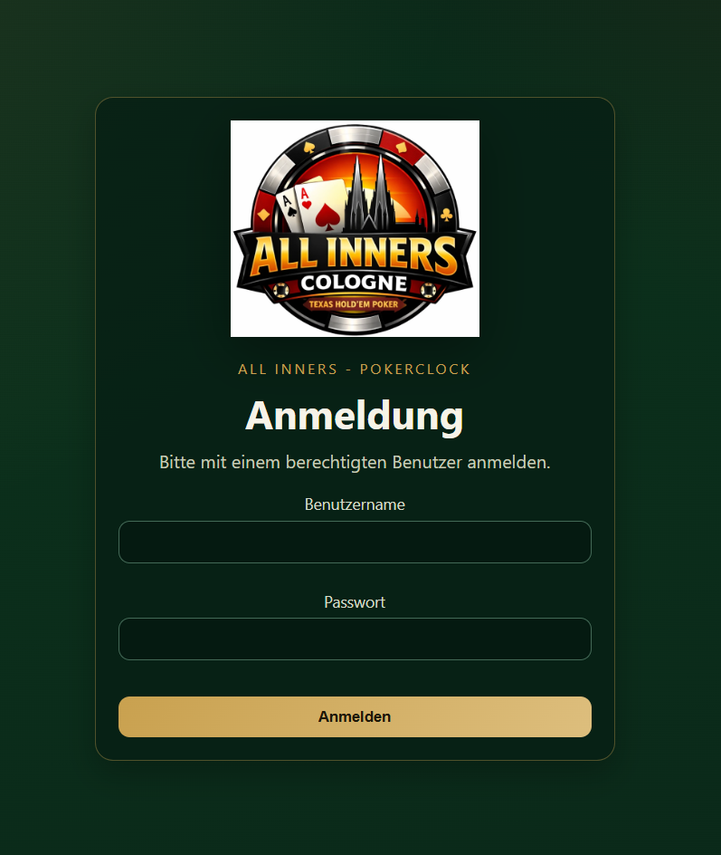
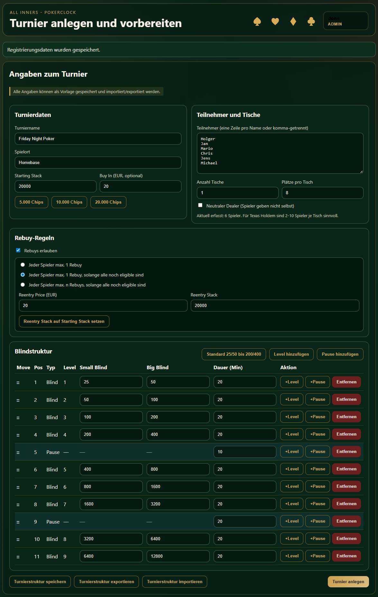
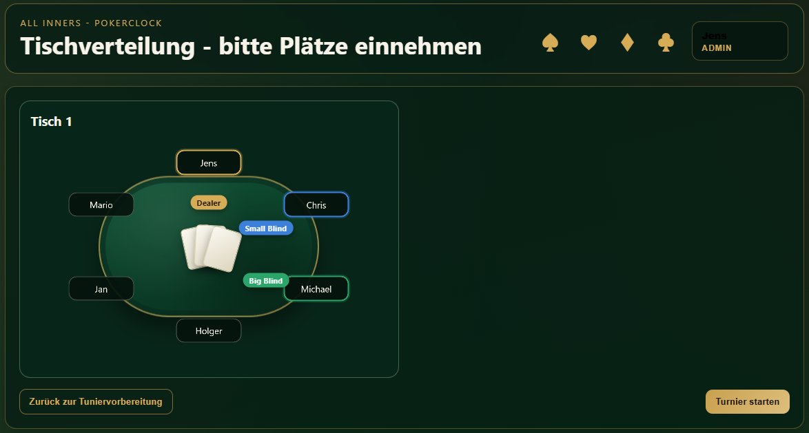
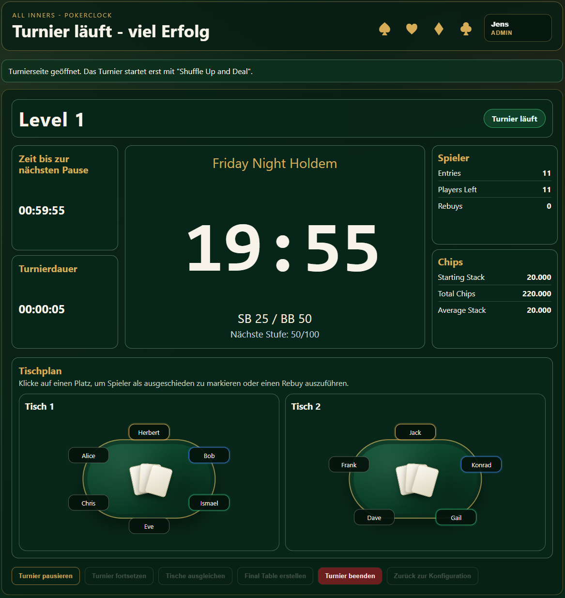
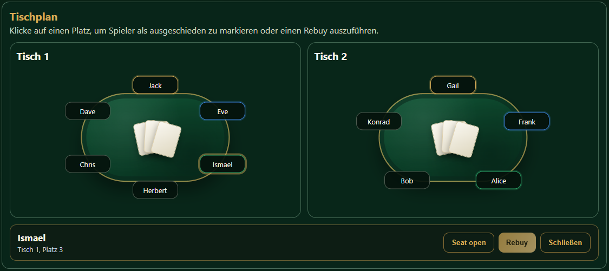
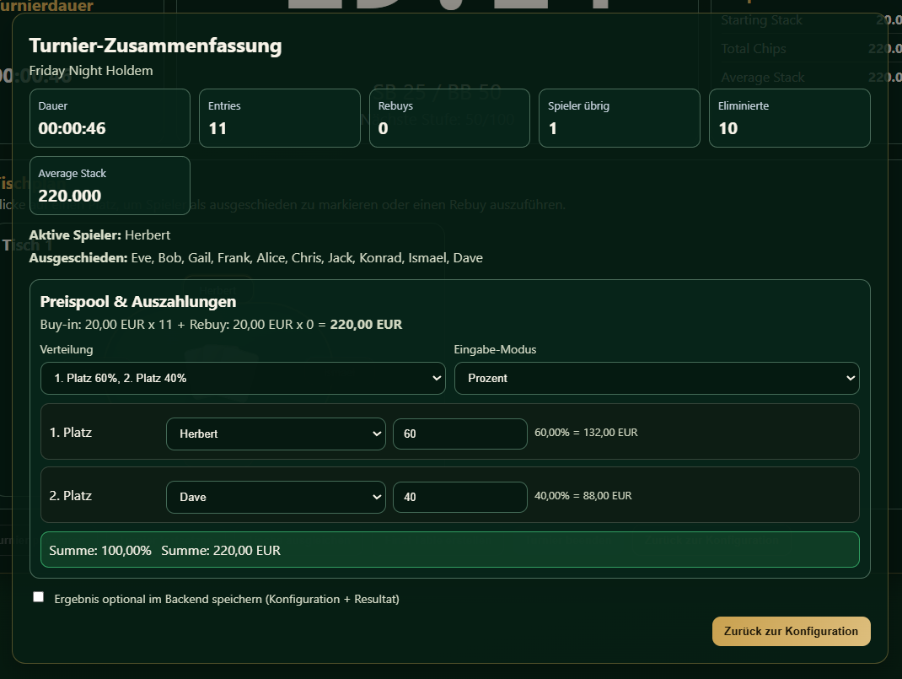

# PokerClock – Pokerturniere digital organisieren

PokerClock ist eine auf **Spring Boot** + **React** basierende Webanwendung zur digitalen Vorbereitung, Durchführung und Verwaltung von Pokerturnieren mit unterstützenden Features wie einer zufälligen Tischverteilung, Verwaltung der Blingstrukturen, Tisch- und Rebuymanagement und abschließendem Tunierabschluss.

## 📋 Inhaltsverzeichnis

1. [Funktionen & Features](#-funktionen--features)
2. [Exemplarischer Turnierablauf](#-exemplarischer-turnierablauf)
3. [Architektur](#-architektur)
4. [Technologie-Stack](#-technologie-stack)
5. [Projekt-Struktur](#-projekt-struktur)
6. [Build & Entwicklung](#-build--entwicklung)
7. [Docker: Build, Deploy & Start](#-docker-build-deploy--start)
8. [MiniPC & Android-PWA MVP](#-minipc--android-pwa-mvp)
9. [Installed Services](docs/installed-services.md)
10. [Aktueller Entwicklungsstand](#-aktueller-entwicklungsstand)
11. [Screenshots der Anwendung](#-screenshots-der-anwendung)
12. [Beiträge & Änderungswünsche](#beiträge--änderungswünsche)
13. [Lizenz](#lizenz)
14. [Haftungsausschluss](#-haftungsausschluss)

---

## ✨ Funktionen & Features

### Phase 1: Turnierkonfiguration
- ✓ Mehrstufige Registrierung mit gruppierten Eingaben
- ✓ Flexibles Rebuy-System
- ✓ Blindstruktur-Editor mit Levels + Breaks
- ✓ Speichern von Registrierungsvorlagen in PostgreSQL beziehungsweise Import/Export für Turniervorlagen

### Phase 2: Tischverteilung & Vorbereitung
- ✓ Automatische zufällige Tischverteilung
- ✓ Dealer- und Blinds-Positionen
- ✓ Optionale Neutral-Dealer-Regel
- ✓ Visuelle Vorschau vor Turnierbeginn

### Phase 3: Live-Turnier
- ✓ Echtzeit-Blind-Countdown und Sprachansagen
- ✓ Spielerstatus, Rebuys und Seat Open
- ✓ Pause, Resume und Turnierende
- ✓ Tischmanagement im pausierten Turnier

### Phase 4: Ergebnisse & Auszahlung
- ✓ Zusammenfassung mit Turnier-Statistiken
- ✓ Automatische Preispool-Berechnung
- ✓ Auszahlungs-Presets und individuelle Verteilungen
- ✓ Deal-Modus mit Spieler-Auswahl
- ✓ Validierung und optionales Speichern von Ergebnissen

### Zusatzfeatures
- ✓ Authentifizierung und Session-Management
- ✓ Responsives Design für Desktop und Tablet
- ✓ Sound-Einstellungen und Dark Mode
- ✓ Persistent Login und Benutzerfeedback

---

## 🧭 Exemplarischer Turnierablauf

### 1. Anmeldung
- Benutzer meldet sich mit berechtigtem Account an.
- Session-Token wird im Frontend gespeichert.

### 2. Turnier vorbereiten
- Turnierdaten, Buy-in-/Rebuy-Regeln, Teilnehmerliste und Blindstruktur erfassen.
- Optional als Vorlage speichern oder bestehende Vorlage laden.

### 3. Tischverteilung erzeugen
- Turnier aus Vorlage erstellen.
- Sitzplätze werden auf Tische verteilt und im Vorbereitungsscreen angezeigt.

### 4. Turnier starten
- In der Tischverteilung wird mit **„Turnier kann beginnen“** auf die Turnierseite gewechselt.
- Das Turnier befindet sich dort zunächst im Zustand **bereit**.
- Erst mit **Shuffle Up and Deal** startet Level 1 fachlich und technisch.

### 5. Live-Spielbetrieb
- Während des Spiels: Seat Open markieren und Rebuy erfassen.
- Bei Bedarf Turnier pausieren, zum Beispiel für organisatorische Aktionen.

### 6. Tischmanagement im Pausenmodus
- **Tische ausgleichen:** Ein Spieler wird vom größten zum kleinsten aktiven Tisch verschoben.
- **Final Table erstellen:** Verfügbare aktive Spieler werden auf **Tisch 1** zusammengeführt.
- Beide Aktionen sind nur verfügbar, wenn das Turnier pausiert ist.

### 7. Turnier beenden und Ergebnis erfassen
- Turnier beenden öffnet die Zusammenfassung mit Kennzahlen.
- Preispool berechnen, Auszahlungsmodus wählen und Spieler zuordnen.
- Ergebnis optional im Backend speichern.

---

## 🏗️ Architektur

PokerClock folgt einer klassischen **Client-Server-Architektur**:

### Backend (Spring Boot 4)
- **REST-API** für Turnierverwaltung, Authentifizierung und Echtzeit-Status
- **PostgreSQL-Datenbank** für persistente Speicherung (Registrierungsvorlagen, Turniere, Ergebnisse)
- **JPA/Hibernate** für Datenzugriff und Entitätsverwaltung
- **Service-Layer** als zentrale fachliche Logik für Turnierzustände, Zeitberechnung, Tischverteilung, Rebuy-Verarbeitung und Ergebnisaufbereitung
- Endpoints:
  - `/api/auth/` – Login, Logout, Authentifizierung
  - `/api/registration/templates/` – Registrierungsvorlagen (CRUD, Import/Export)
   - `/api/` – Turnier-Setup, Status, Aktionen (Start, Pause, Resume, End, Seat Open, Rebuy)
   - `/api/table/` – Tischmanagement (Balancing, Final Table)
  - `/api/results` – Optionale Speicherung von Turnierergebnissen

### Fachliche Zustandslogik
- Ein Turnier durchläuft die Zustände **READY**, **RUNNING**, **PAUSED** und **ENDED**.
- Der Wechsel von der Tischverteilung auf die Turnierseite ist bewusst vom echten Start getrennt.
- Erst über **Shuffle Up and Deal** beginnt das Turnier fachlich: Die Startsequenz wird abgespielt und die Uhr wird gestartet.
- Organisatorische Eingriffe wie **Tische ausgleichen** und **Final Table erstellen** sind ausschließlich im Zustand **PAUSED** erlaubt.

### Architektonische Besonderheiten der Turniersteuerung
- Die **Tischverteilung** wird serverseitig als JSON im Turnier gespeichert und bei Statusabfragen an das Frontend zurückgegeben.
- Das Frontend arbeitet zustandsorientiert mit den Ansichten **Registrierung**, **Tischverteilung**, **Turnier** und **Zusammenfassung**.
- Die Turnierseite verwendet denselben Status-Endpunkt sowohl für Clock, Blindinformationen und Kennzahlen als auch für die Anzeige des aktuellen Tischplans.
- Die Ergebniszusammenfassung ist als kontrollierter Abschlussdialog umgesetzt: Sie wird nach Turnierende angezeigt und kann nur über die vorgesehenen Aktionen verlassen werden.

### Frontend (React 18 + Vite)
- **React-Komponenten** für alle Phasen (Authentifizierung, Registrierung, Tischverteilung, Turnier, Ergebnisse)
- **Vite** als Build-Tool und Dev-Server
- **CSS Modules** für Styling
- ✓ Responsive Design für Desktop und Tablet

### Persistenz & Datenbank
- **PostgreSQL** läuft im Docker Container
- Hibernate-Schemaaktualisierung und kompatible Schema-Patches für vorhandene Datenvolumes
- Volumes für Datenpersistenz über Container-Restarts

### Authentifizierung
- **Session-basiert** mit Token-Header (`X-Auth-Token`)
- Benutzer in PostgreSQL verwaltet

---

## 🛠️ Technologie-Stack

| Komponente | Technologie | Version |
|------------|-------------|---------|
| Backend | Spring Boot | 4.0.5 |
| Language (Backend) | Java | 25 |
| Language (Frontend) | JavaScript (React) | ES2020+ |
| Database | PostgreSQL | - |
| Build (Frontend) | Vite | 5.4 |
| Container | Docker & Docker Compose | - |
| ORM | JPA/Hibernate | - |

---

## 📁 Projekt-Struktur

```
PokerClock/
├── backend/
│   ├── src/main/java/com/pokerclock/
│   │   ├── api/                    # REST DTOs (Request/Response)
│   │   ├── controller/             # REST Endpoints
│   │   ├── model/                  # JPA Entities
│   │   ├── repository/             # Data Access Layer (JPA)
│   │   ├── service/                # Business Logic
│   │   └── config/                 # Spring Config (Security, Web, DB)
│   ├── pom.xml                     # Maven Dependencies
│   └── Dockerfile                  # Container für Backend
│
├── frontend/
│   ├── src/
│   │   ├── pages/                  # Page Components (Login, Turnier, etc.)
│   │   ├── components/             # Reusable Components
│   │   ├── api.js                  # API-Client
│   │   ├── App.jsx                 # Root Component
│   │   └── index.css               # Global Styles
│   ├── package.json                # NPM Dependencies
│   ├── vite.config.js              # Vite Config
│   └── Dockerfile                  # Container für Frontend
│
├── docker-compose.yml              # Orchestration (Backend, Frontend, DB)
└── README.md                       # Diese Datei
```

---

## 🔨 Build & Entwicklung

### Voraussetzungen
- **Node.js** 18+ (für Frontend)
- **Java 25** (für Backend)
- **Maven 3.8+** (für Backend)

### Entwicklung (lokal)

#### 1. Backend starten
```bash
cd backend
mvn spring-boot:run
```
✓ Backend verfügbar unter `http://localhost:8080`

#### 2. Frontend starten (in neuem Terminal)
```bash
cd frontend
npm install
npm run dev
```
✓ Frontend verfügbar unter `http://localhost:5173` (oder wie in der Konsole angezeigt)

### Build für Production

#### Frontend bauen
```bash
cd frontend
npm install
npm run build
# Output: dist/
```

#### Backend bauen
```bash
cd backend
mvn clean package -DskipTests
# Output: target/pokerclock-backend-0.0.1-SNAPSHOT.jar
```

---

## 🐳 Docker: Build, Deploy & Start

### Installation mit Docker Compose

1. **Docker Engine und Docker Compose starten**

2. **Umgebungsvariablen vorbereiten (Pflicht):**
   ```bash
   # macOS / Linux
   cp .env.example .env
   ```
   ```powershell
   # Windows PowerShell
   Copy-Item .env.example .env
   ```
   Dann in `.env` sichere Werte setzen:
   - `POSTGRES_PASSWORD`
   - `DB_PASSWORD`
   - Beide Passwortwerte müssen identisch sein.

   Beim ersten Start werden die Demo-Konten `Admin` (`admin`), `Floorman` (`floorman`), `Tisch1` (`tisch`) und `Tisch2` (`tisch`) angelegt. Für einen produktiven Betrieb `secrets/users.example.json` nach `secrets/users.json` kopieren, sichere Passwörter setzen und `APP_SEED_USERS_FILE=./secrets/users.json` in `.env` eintragen. Die lokale Datei ist von Git ausgeschlossen und wird von Docker nur read-only als Secret an das Backend übergeben.

3. **Im Projektstamm den Stack bauen und im Hintergrund starten:**
   ```bash
   docker compose up --build -d
   ```

4. **Start prüfen:**
   ```bash
   docker compose ps
   docker compose exec backend curl -f http://localhost:8081/actuator/health
   ```

5. **Anwendung testen:**
   - Direkt auf dem Host: `http://127.0.0.1:8085`
   - Hinter einem System-Nginx: über den dort eingerichteten Hostnamen, zum Beispiel `https://pokerclock.local`

6. **Stack stoppen:**
   ```bash
   docker compose down
   ```

### Stack-Details (docker-compose.yml)

| Service | Port | Beschreibung |
|---------|------|-------------|
| `frontend` | `127.0.0.1:8085` | React App (Nginx), nur lokal für System-Nginx erreichbar |
| `backend` | keiner | Spring Boot REST API im privaten Compose-Netz |
| `db` | keiner | PostgreSQL im privaten Compose-Netz |

### Volumes & Persistenz
- `db_data` – PostgreSQL Daten (persistent über Restarts)
- Automatische Datenbank-Initialisierung beim ersten Start

### Docker-Logs auf dem MiniPC

```bash
cd /srv/docker/pokerclock
docker compose logs --tail=100 db backend frontend
```

### Build und Deploy auf dem MiniPC

Die produktive Zielumgebung ist ein Ubuntu-MiniPC mit Docker Engine. Der Reverse Proxy terminiert HTTPS; Docker Compose veröffentlicht PokerClock ausschließlich auf dem lokalen Host-Port `127.0.0.1:8085`.

1. **Auf dem MiniPC in das Git-Repository wechseln und lokalen Zustand prüfen:**
   ```bash
   cd /srv/docker/pokerclock
   git status --short --branch
   git fetch origin
   ```
   Die produktive `.env` und `secrets/users.json` werden nicht von Git verwaltet und bleiben beim Branch-Wechsel erhalten. Andere lokale Änderungen, zum Beispiel an `docker-compose.yml`, müssen vor dem Wechsel übernommen oder gesichert werden:
   ```bash
   git diff -- docker-compose.yml
   git stash push -m "MiniPC lokale Compose-Konfiguration" -- docker-compose.yml
   ```

2. **Den Produktiv-Branch `main` auf dem MiniPC auschecken und aktualisieren:**
   ```bash
   cd /srv/docker/pokerclock
   git checkout main
   git pull --ff-only origin main
   ```
   Soll stattdessen ein anderer Branch deployed werden, ersetzt du in beiden Befehlen `main`, zum Beispiel:
   ```bash
   git checkout feature/rollen
   git pull --ff-only origin feature/rollen
   ```
   Wenn der Branch auf dem MiniPC noch nicht lokal existiert, verwende:
   ```bash
   git checkout -b feature/rollen origin/feature/rollen
   ```

3. **Zum Projekt wechseln und die Konfiguration prüfen:**
   ```bash
   cd /srv/docker/pokerclock
   test -f .env && echo ".env vorhanden" || cp .env.example .env
   nano .env
   ```
   `POSTGRES_PASSWORD` und `DB_PASSWORD` müssen identisch sein. Für einen produktiven Betrieb die lokale Benutzer-Secret-Datei erzeugen, mit sicheren Zugangsdaten füllen und den Pfad als `APP_SEED_USERS_FILE` in `.env` setzen:
   ```bash
   cp secrets/users.example.json secrets/users.json
   chmod 600 secrets/users.json
   ```
4. **Images für den MiniPC bauen und Container starten:**
   ```bash
   docker compose up --build -d
   ```
5. **Start und Backend-Gesundheit prüfen:**
   ```bash
   docker compose ps
   docker compose exec backend curl -f http://localhost:8081/actuator/health
   ```
6. **Den externen Zugriff prüfen:**
   ```bash
   curl --cacert /etc/nginx/certs/home-ca.crt -I https://pokerclock.local
   ```
   Erwartet wird eine erfolgreiche HTTP-Antwort, nicht `502 Bad Gateway`.
7. **Bei einem Fehler die Containerprotokolle lesen:**
   ```bash
   docker compose logs --tail=100 db backend frontend
   ```

Ein erneutes `docker compose up --build -d` aktualisiert die Container, ohne das Docker-Volume `db_data` zu löschen. `docker compose down -v` entfernt dagegen auch die persistierten Daten und darf nicht für ein normales Update verwendet werden.

### PokerClock auf Android installieren

Nach einem erfolgreichen Deploy kann PokerClock im Android-Browser als eigenständige Anwendung installiert werden:

1. `https://pokerclock.local` in Chrome auf dem Android-Gerät öffnen und anmelden.
2. Im Chrome-Menü **App installieren** beziehungsweise **Zum Startbildschirm hinzufügen** wählen.
3. Die Installation bestätigen. PokerClock erscheint anschließend mit eigenem Icon und startet ohne Browser-Adressleiste.

Die Installation setzt voraus, dass Android dem Zertifikat der Home-CA vertraut und das Gerät im Heimnetz `pokerclock.local` auflösen kann. Bei einem Update wird die PWA beim nächsten Aufruf automatisch aktualisiert. Für eine vollständige Aktualisierung kann die Anwendung einmal geschlossen und erneut geöffnet werden.

---

## MiniPC & Android-PWA MVP

PokerClock wird im Heimnetz auf dem Ubuntu-MiniPC unter `/srv/docker/pokerclock` betrieben. Der MiniPC baut und startet die drei Docker-Compose-Dienste `db`, `backend` und `frontend`. Der Reverse Proxy auf dem MiniPC stellt die Anwendung unter `https://pokerclock.local` bereit; die Namensauflösung erfolgt durch den bestehenden dnsmasq-Dienst. Die Android-Steuerung verwendet dieselbe responsive React-Anwendung und kann anschließend als PWA installiert werden.

### Deployment auf dem MiniPC

Die folgenden Schritte sind nach Komponenten getrennt. Befehle unter **Entwicklungs-PC** werden in der lokalen Git-Arbeitskopie ausgeführt. Befehle unter **MiniPC** werden per SSH auf dem Server ausgeführt.

#### 1. Änderungen auf dem Entwicklungs-PC veröffentlichen

**Komponente: Entwicklungs-PC, im Repository `pokerClock`**

```bash
git status
git add README.md
git commit -m "Dokumentiere MiniPC-Deployment"
git push origin feature/rollen
```

Wenn die Änderungen bereits auf dem Remote-Branch liegen, entfällt dieser Schritt.

#### 2. Quellcode auf dem MiniPC aktualisieren

**Komponente: MiniPC**

```bash
cd /srv/docker/pokerclock
git fetch origin
git checkout feature/rollen
git pull --ff-only origin feature/rollen
git status --short --branch
```

Lokale produktive Dateien wie `.env` und `secrets/users.json` dürfen nicht durch den Git-Abgleich überschrieben werden.

#### 3. Produktionskonfiguration auf dem MiniPC prüfen

**Komponente: MiniPC, Datei `/srv/docker/pokerclock/.env`**

```bash
nano /srv/docker/pokerclock/.env
```

Die Datei muss mindestens enthalten:

```dotenv
POSTGRES_PASSWORD=<starkes-datenbankpasswort>
DB_PASSWORD=<dasselbe-datenbankpasswort>
APP_SEED_USERS_FILE=./secrets/users.json
```

**Komponente: MiniPC, Datei `/srv/docker/pokerclock/secrets/users.json`**

```bash
mkdir -p /srv/docker/pokerclock/secrets
cp /srv/docker/pokerclock/secrets/users.example.json /srv/docker/pokerclock/secrets/users.json
nano /srv/docker/pokerclock/secrets/users.json
chmod 600 /srv/docker/pokerclock/secrets/users.json
```

In `users.json` stehen die Startbenutzer mit ihren Passwörtern. Die Datei wird nicht committed und von Docker read-only als Secret in den Backend-Container eingebunden.

#### 4. Docker-Stack auf dem MiniPC neu bauen und starten

**Komponente: MiniPC, Docker Compose im Projektverzeichnis**

```bash
cd /srv/docker/pokerclock
docker compose config --quiet
docker compose build --no-cache backend frontend
docker compose up -d --force-recreate
```

Ein normales Update löscht die Datenbank nicht. `docker compose down -v` darf nur verwendet werden, wenn die Datenbank einschließlich Benutzer und Turniere bewusst gelöscht werden soll.

#### 5. Start auf dem MiniPC prüfen

**Komponente: MiniPC**

```bash
cd /srv/docker/pokerclock
docker compose ps
docker compose exec backend curl -f http://localhost:8081/actuator/health
docker compose logs --tail=200 db backend frontend
```

Die Container `db` und `backend` müssen `healthy` sein. Beim ersten Start müssen im Backend-Log Einträge wie `Seed user 'Admin' created.` erscheinen.

Die Seed-Benutzer können ohne Passwörter abgefragt werden:

**Komponente: MiniPC, PostgreSQL im Docker-Container**

```bash
docker compose exec db psql -U postgres -d pokerclock -c \
"SELECT id, username, role, created_at, updated_at FROM app_user ORDER BY id;"
```

#### 6. DNS, Reverse Proxy und Zugriff prüfen

**Komponente: MiniPC, dnsmasq**

```bash
getent hosts pokerclock.local
```

Die Ausgabe muss auf die LAN-IP des MiniPCs zeigen. Der vorhandene dnsmasq-Eintrag darf nicht durch einen zweiten Eintrag für denselben Hostnamen dupliziert werden.

**Komponente: MiniPC, Reverse Proxy**

```bash
curl -k -I https://pokerclock.local
```

**Komponente: Client im Heimnetz, zum Beispiel Laptop oder Smartphone**

Im Browser öffnen:

```text
https://pokerclock.local
```

Der Reverse Proxy terminiert HTTPS und leitet zum lokal gebundenen PokerClock-Frontend weiter. Backend, Management-Port und PostgreSQL werden nicht direkt im Heimnetz veröffentlicht.

### Zieltopologie

- Entwicklungs-PC: Git-Arbeitskopie, Tests und Push auf den Remote-Branch.
- MiniPC: Git-Checkout, Docker Compose, PostgreSQL, Spring Boot und Frontend-Nginx.
- Reverse Proxy auf dem MiniPC: HTTPS für `pokerclock.local` und Weiterleitung zum Frontend.
- dnsmasq auf dem MiniPC: Auflösung von `pokerclock.local` auf die LAN-IP des MiniPCs.
- Client: Zugriff per Browser oder installierter Android-PWA.

```text
Laptop oder Android-PWA
   |
https://pokerclock.local
   |
Reverse Proxy mit HTTPS auf dem MiniPC
   |
127.0.0.1:8085 -> Frontend-Nginx -> /api -> Spring Boot -> PostgreSQL
```

### Noch offene Umsetzungsschritte

1. **Mobile Turniersteuerung liefern:** Für kleine Displays eine fokussierte Ansicht mit Uhr, Blindstufen, Spielerzahlen sowie Pause, Fortsetzen, Beenden, Seat Open und Rebuy implementieren. Registrierung und Tischvorbereitung bleiben im MVP auf dem Laptop.
2. **Mehrgerätebetrieb erweitern und nachweisen:** Browser- und Android-PWA-Szenarien gegen den MiniPC durchführen.

### MVP-Regeln

- Mehrere berechtigte Geräte dürfen gleichzeitig verbunden sein; ein exklusiver Steuerungs-Lock ist nicht Bestandteil des MVP.
- Eine PWA benötigt eine Verbindung zum Heimnetz und zum MiniPC; Offline-Steuerung gehört nicht zum Umfang.
- Die spätere Entwicklung einer nativen Android-App bleibt möglich, weil sie denselben versionierten API-Vertrag verwenden kann.

---

## Aktueller Entwicklungsstand

### Umgesetzt

- Docker-Deployment auf dem Ubuntu-MiniPC, lokaler Frontend-Port `127.0.0.1:8085`, Reverse Proxy, HTTPS und `dnsmasq` für `pokerclock.local`.
- Persistierte Workflow-Phasen `REGISTRATION`, `PREPARATION` und `TOURNAMENT`. Neu verbundene Browser leiten ihre Ansicht aus `GET /api/status` ab.
- Serverseitig erzeugte Tischverteilung; der Client erzeugt keine fachlich maßgebliche Zufallsverteilung.
- Gemeinsame Ansicht bei Übergängen zwischen Vorbereitung, Turniersteuerung und Registrierung.
- Nach einem Turnierende erscheint die Zusammenfassung auf allen verbundenen Clients.
- Sitzansagen werden nicht mehr bei jedem Status-Poll neu gestartet.
- Optimistische Versionsprüfung mit JPA-`@Version`: Jede schreibende Turnieraktion sendet die aus dem Status gelesene Revision im `If-Match`-Header. Veraltete Aktionen werden mit `409 Conflict` abgewiesen; der Client lädt den gemeinsamen Status erneut.
- Installierbare PWA mit Web-App-Manifest, App-Icon und Service Worker für `https://pokerclock.local`.
- Backend-Tests für Workflow-Phasen, Übergänge und Versionskonflikte. Stand dieses Entwicklungsschritts: 40 Tests erfolgreich.

### Noch nicht umgesetzt

- Speziell verdichtete mobile Turniersteuerung.

## 🔐 Sicherheits- & Deployment-Checkliste (Pflicht vor Veröffentlichung)

Diese Punkte sollten erledigt sein, bevor du die App anderen zeigst oder in ein erreichbares Umfeld deployest.

### A) Für das Deployment auf dem MiniPC

1. **Lokale Secrets setzen, nie committen**
   - `.env.example` nach `.env` kopieren.
   - Starke Werte für `POSTGRES_PASSWORD` und `DB_PASSWORD` setzen.
   - Sicherstellen, dass `.env` nicht versioniert ist.

2. **Seed-Benutzer konfigurieren**
   - Eine lokale `secrets/users.json` aus `secrets/users.example.json` erzeugen.
   - Sichere Passwörter setzen und `APP_SEED_USERS_FILE=./secrets/users.json` in `.env` eintragen.
   - Die Seed-Datei wird von Docker als read-only Secret an das Backend übergeben.

3. **Image/Code-Stand bereinigen**
   - Keine Build-Artefakte in Git (`target/`, `dist/`).
   - Keine temporären lokalen Dateien mit Zugangsdaten im Repo.

4. **Sichtprüfung vor Freigabe**
   - `git status` muss sauber sein.
   - Nochmal nach harten Credentials suchen (z. B. mit `gitleaks`).

### B) Für **offenes Kubernetes-Cluster** (Internet / extern erreichbar)

1. **Secrets-Management erzwingen**
   - Keine Klartext-Secrets in `Deployment`, `ConfigMap`, `values.yaml`.
   - Secrets nur über `Secret`, Sealed Secrets, External Secrets oder Vault.
   - Keine Default-Passwörter verwenden.

2. **Produktionsfähige Authentifizierung verwenden**
   - Aktuell ist die Session-Verwaltung in-memory und auf einfache Nutzung ausgelegt.
   - Für offene Umgebungen stattdessen robuste Auth-Lösung einsetzen (z. B. OIDC/JWT + serverseitige Session-/Token-Strategie).
   - Token-Lebensdauer, Logout-Invalidierung und Rotationsstrategie definieren.

3. **Transport & Ingress absichern**
   - Nur HTTPS/TLS, HTTP auf HTTPS umleiten.
   - CORS restriktiv setzen (nur benötigte Origins).
   - Security-Header auf Ingress/Proxy aktivieren.

4. **Datenbank absichern**
   - DB nicht öffentlich exponieren.
   - Eigener DB-User mit minimalen Rechten.
   - Backups, Restore-Test und Rotationsprozess für DB-Credentials definieren.

5. **Container-Härtung**
   - Images mit festen Versionen bauen, regelmäßig patchen.
   - Container möglichst als non-root ausführen.
   - `readOnlyRootFilesystem`, `allowPrivilegeEscalation: false`, sinnvolle `securityContext` setzen.

6. **Netzwerk- und Laufzeitschutz**
   - `NetworkPolicy` für minimale Verbindungen.
   - Ressourcenlimits und Requests setzen.
   - Liveness/Readiness-Probes aktiv halten.

7. **Betrieb & Monitoring**
   - Zentrales Logging und Metriken aktivieren.
   - Alerting für Fehlerquoten, Restart-Loops, Auth-Fehler, DB-Verbindungsprobleme.
   - Auditierbare Deployment-Pipeline verwenden.

8. **Compliance vor Public Release**
   - Git-Historie auf alte Secrets prüfen und ggf. bereinigen.
   - Alle früher verwendeten Credentials rotieren.
   - Optional: Secret-Scanning als CI-Gate erzwingen.

### Empfohlener Minimalablauf vor Veröffentlichung

1. Lokalen Stand committen und `git status` prüfen.
2. Secret-Scan über aktuellen Stand und Historie durchführen.
3. Betroffene Credentials rotieren.
4. Erst danach Repository/Deployment öffentlich machen.

---

## 📸 Screenshots der Anwendung

### 1. Login Screen


**Beschreibung:**
- Authentifizierung mit Benutzername und Passwort
- Session-Token wird nach Login gespeichert
- Fehlerbehandlung bei falschen Credentials

### 2. Turniervorbereitung (Registrierung & Blindstruktur)


**Beschreibung:**
- **Turnierdaten:** Name, Standort, Starting Stack
- **Finanzielle Parameter:** Buy-in in EUR, Rebuy-Optionen mit Preisen
- **Teilnehmer:** Liste der Spieler (kommagetrennt oder zeilenweise)
- **Blindstruktur-Editor:**
  - Levels mit Small Blind / Big Blind
  - Pause-Einträge
  - Drag & Drop zum Reordern
  - Standardstruktur verfügbar
- **Speichern & Importieren:** JSON-Export und -Import von Vorlagen

### 3. Tischverteilung (Preparation Phase)


**Beschreibung:**
- Visuelle Darstellung der Tischverteilung
- Alle Spieler sind zugeordnet
- Dealer- und Blinds-Positionen sind markiert
- Kontrollierter Übergang mit **„Turnier kann beginnen“**
- Bestätigungsdialog vor dem Wechsel auf die Turnierseite
- Noch **kein** Sound und **kein** Start der Uhr in dieser Phase
- Möglichkeit, zur Konfiguration zurückzukehren

### 4. Turnier im Betrieb (Running Tournament)


**Beschreibung:**
- **Ready-Phase vor dem echten Start:** Nach dem Wechsel auf die Turnierseite ist zunächst nur der Turnierstatus sichtbar.
- **Shuffle Up and Deal** ist der fachliche Startpunkt: Erst dann laufen Beep-Sequenz, Sprachansage und Clock.
- **Live Clock:** Countdown für aktuelle Blindstufe
- **Current Blinds:** SB/BB-Werte und nächste Stufe
- **Spieler-Statistiken:** Entries, Players Left, Average Stack, Total Chips
- **Rebuys:** Gezählte Rebuys während des Turniers
- **Tischplan:** Alle aktiven Spieler mit Live-Anzeige
- **Kontrollbuttons:** abhängig vom Zustand, z. B. Shuffle Up and Deal, Pause, Resume, End Tournament

### 5. Spieler-Aktionen (Seat Open / Rebuy)


**Beschreibung:**
- Klick auf einen Spieler öffnet diese Detailansicht
- **Seat Open:** Spieler als ausgeschieden markieren
- **Rebuy:** Spieler mit neuem Stack zurück ins Spiel nehmen
- Daten werden in Echtzeit aktualisiert

### 6. Turnier-Zusammenfassung & Ergebnisse


Nach dem Klick auf „Turnier beenden":
- **Bestätigungsdialog** in der App (kein Browser-Popup)
- **Summary Modal** mit:
  - Turnier-Statistiken (Dauer, Einträge, Rebuys, Spieler übrig)
  - **Preispool-Berechnung:** Buy-in × Entries + Rebuy × Rebuys
  - **Auszahlungs-Presets:** 60/40, 50/30/20, oder Custom Top-N
  - **Deal-Modus:** Spielerbasierte Verteilung (ICM-Deals)
  - **Eingabe-Modi:** Prozent oder Betrag
  - **Spieler-Auswahl:** Automatische Vorschläge nach Ausscheidungsreihenfolge
  - **Optionales Speichern:** Ergebnis im Backend persistieren
   - **Kontrollierter Abschluss:** Die Zusammenfassung bleibt geöffnet, bis sie über die vorgesehene Aktion beendet wird

**Technische Einordnung:**
- Die Zusammenfassung verwendet die finalen Statusdaten des Turniers und ergänzt diese um berechnete Werte wie Preispool, Summenprüfung und Auszahlungsmodelle.
- Die Eingabemaske validiert Summen, doppelte Spielerzuordnungen und unvollständige Payout-Zuordnungen direkt im Frontend.
- Optional kann die komplette Ergebnisstruktur inklusive Konfiguration und Auszahlungen über `/api/results` im Backend archiviert werden.

---

## 🚀 Getting Started Schnellübersicht

### 1. **Lokal entwickeln (Schnellste Variante)**
```bash
# Terminal 1: Backend
cd backend && mvn spring-boot:run

# Terminal 2: Frontend
cd frontend && npm run dev
```
→ Öffne `http://localhost:5173`

### 2. **Mit Docker Compose auf dem MiniPC**
```bash
cd /srv/docker/pokerclock
docker compose up --build
```
→ Öffne `https://pokerclock.local`
→ Logs: `docker compose logs --tail=100 db backend frontend`

### 3. **Build für Production**
```bash
# Frontend
cd frontend && npm run build

# Backend
cd backend && mvn clean package -DskipTests

```

---

## Beiträge & Änderungswünsche

Dieses Repository ist **öffentlich**. Damit gilt aktuell:
- Die Anwendung kann angesehen und geklont werden.
- Forks des Repositories sind erlaubt.
- Direkte Änderungen am Original-Repository sind nur durch den Repository-Eigentümer möglich.
- Externe Beiträge sollen als **GitHub Issue** dokumentiert werden.

### Gewünschter Weg für Änderungen

Wenn du einen Fehler melden oder eine Änderung vorschlagen möchtest, nutze bitte den Bereich **Issues** im GitHub-Repository.

Verwendet werden dafür aktuell diese Vorlagen:
- **Bug Report** für Fehler, Fehlverhalten und technische Probleme
- **Feature Request** für neue Funktionen, UX-Ideen oder Änderungswünsche

### So sollen Änderungswünsche dokumentiert werden

Ein gutes Issue enthält nach Möglichkeit:
- eine kurze, präzise Überschrift
- eine Beschreibung des aktuellen Verhaltens
- eine Beschreibung des gewünschten Verhaltens
- Schritte zur Reproduktion, falls es sich um einen Fehler handelt
- Screenshots oder Kontextinformationen, falls hilfreich

### Hinweise zum Zugriffsmodell

Das Repository ist bewusst so konfiguriert, dass andere Personen:
- das Projekt lesen können
- das Projekt lokal klonen können
- eigene Forks anlegen können
- Issues anlegen können

Direkte Pushes auf das Original-Repository sind jedoch nicht vorgesehen.

Pull Requests aus Forks sind technisch grundsätzlich möglich, der bevorzugte Weg für Vorschläge und Änderungsanfragen ist in diesem Projekt jedoch weiterhin ein **Issue**.

---

## Lizenz

Dieses Projekt steht unter der MIT-Lizenz. Die vollständigen Lizenzbedingungen findest du in [LICENSE](./LICENSE).

Die MIT-Lizenz erlaubt insbesondere:
- Nutzung der Software
- Kopieren und Weitergabe
- Anpassung und Erweiterung
- Veröffentlichung und Weitervertrieb

Dabei muss der Lizenzhinweis erhalten bleiben.

---

## Haftungsausschluss

Diese Software wird ohne ausdrückliche oder stillschweigende Gewährleistung bereitgestellt. Die Nutzung erfolgt auf eigene Verantwortung.

Es wird keine Garantie dafür übernommen, dass die Anwendung fehlerfrei funktioniert, für einen bestimmten Zweck geeignet ist oder keine Schäden, Fehlfunktionen, Datenverluste oder sonstige Probleme verursacht.

Die Haftung richtet sich im Übrigen nach den Regelungen der MIT-Lizenz.
